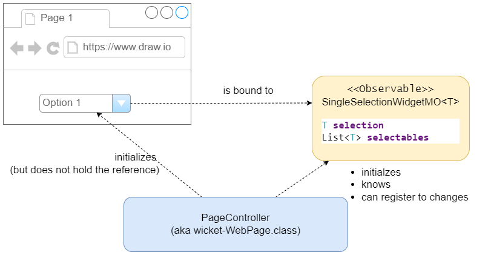
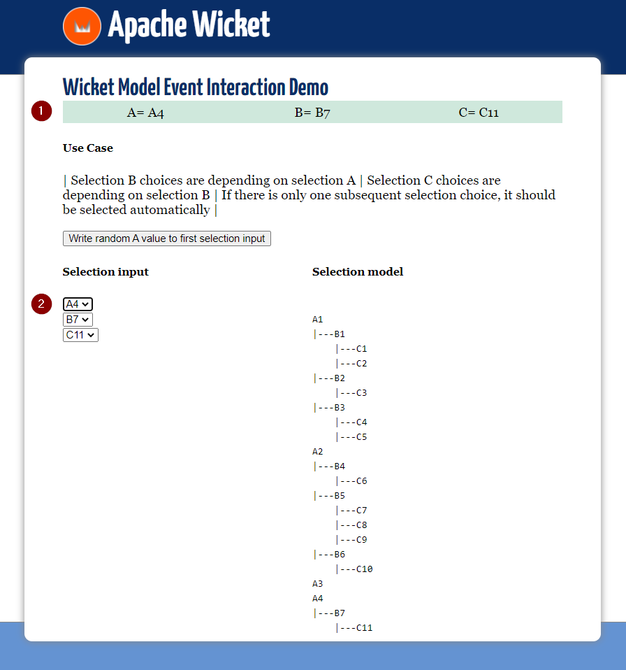

= wicket-demo-eventinteraction

== Demonstration purpose
This project shows how the classic observer pattern applied to wicket models might be used to declutter your code. In other words, it shows how you might use an event based client micro-architecture to update your values in various models.

* The widget is only bound to its model.
** Every widget has one isolated model.
** _Binding_ means _data_ and _state_ binding.
* Everyone interested in model changes can register to get notified on changes, i.e. register to model events.

== Screenshot & Use Case

==== Notes
* The values of (1) are held in a model updated by model change events.
* The model change events are emitted by the observable model bound to widgets  shown at (2).

== Advantages 
* You just react to specific changes instead of keeping the entire model world in order by hand in every model-mutating situation.
* It is very easy to implement a state model (visible=Y/N, enabled=Y/N)
* It is very easy to have decoupled, isolated, specific models for different purposes with redundant information in sync, instead of trying to have a one-fits-all selection model used by every panel, component, widget, whatever. I.e.
** Increased reusability
** Increased maintainability

== Disadvantages
* Depending on the real life business complexity, the listener maintenance might not be as easy as portrayed here in this small example. You might be required to switch listeners off from time to time to prevent endless event-loops.

== Alternative Scenarios & Ideas
* Depending on how dynamic the selection choices of a real live uses case would be, you might consider, having all values as ``selectables`` in your widget model, but as a reaction to model change events you just change a predicate in your model, which filters the selectables for selection on the screen.
** Predicates for authorization and business rules could be joined easily.
* Writing observable model code - such as ``SingleSelectionWidgetMO`` - is error prone. Therefore it might be worth considering a code generator, e.g. via Java's annotation pre-processor approach.

== Running the demo
This application is a modified wicket quickstart project, so just run
[source]
----
mvn jetty:run
----